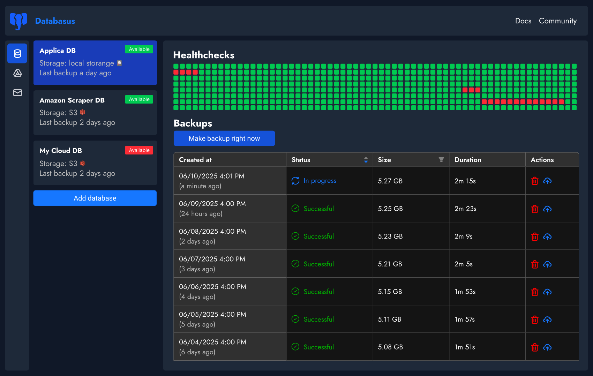
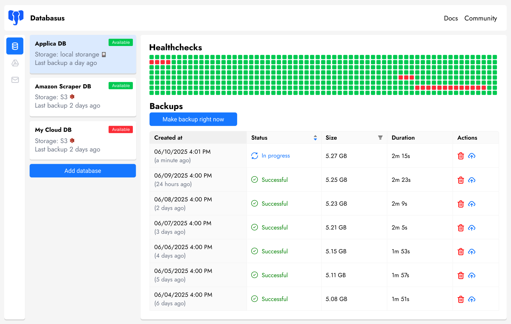

<div align="center">
  

  <h3>PostgreSQL、MySQL 和 MongoDB 备份工具</h3>
  <p>Databasus 是一个免费、开源、可自托管的数据库备份工具（专注于 PostgreSQL）。支持多种存储方式（S3、Google Drive、FTP 等）和进度通知（Slack、Discord、Telegram 等）。前身为 Postgresus（请参阅迁移指南）。</p>
  
  <!-- Badges -->
   [](https://www.postgresql.org/)
  [](https://www.mysql.com/)
  [](https://mariadb.org/)
  [](https://www.mongodb.com/)
  <br />
  [](LICENSE)
  [](https://hub.docker.com/r/rostislavdugin/postgresus)
  [](https://github.com/databasus/databasus)
  [](https://github.com/databasus/databasus)
  [](https://github.com/databasus/databasus)

  <p>
    <a href="#-features">功能特性</a> •
    <a href="#-installation">安装</a> •
    <a href="#-usage">使用</a> •
    <a href="#-license">许可证</a> •
    <a href="#-contributing">贡献</a>
  </p>

  <p style="margin-top: 20px; margin-bottom: 20px; font-size: 1.2em;">
    <a href="https://databasus.com" target="_blank"><strong>🌐 Databasus 官网</strong></a>
  </p>
  
  

  
  
 
</div>

---

## ✨ 功能特性

### 💾 **支持的数据库**

- **PostgreSQL**: 12、13、14、15、16、17 和 18
- **MySQL**: 5.7、8 和 9
- **MariaDB**: 10 和 11
- **MongoDB**: 4、5、6、7 和 8

### 🔄 **计划备份**

- **灵活调度**: 每小时、每天、每周、每月或 cron 表达式
- **精确时间**: 在特定时间运行备份（例如，凌晨 4 点低流量时段）
- **智能压缩**: 平衡压缩实现 4-8 倍空间节省（约 20% 开销）

### 🗄️ **多种存储目标** <a href="https://databasus.com/storages">(查看支持列表)</a>

- **本地存储**: 将备份保存在您的 VPS/服务器上
- **云存储**: S3、Cloudflare R2、Google Drive、NAS、Dropbox、SFTP、Rclone 等
- **安全**: 所有数据都在您的控制之下

### 📱 **智能通知** <a href="https://databasus.com/notifiers">(查看支持列表)</a>

- **多渠道**: 邮件、Telegram、Slack、Discord、webhook
- **实时更新**: 成功和失败通知
- **团队集成**: 完美适配 DevOps 工作流

### 🔒 **企业级安全** <a href="https://databasus.com/security">(文档)</a>

- **AES-256-GCM 加密**: 为备份文件提供企业级保护
- **零信任存储**: 备份经过加密，对攻击者毫无用处，因此可以安全地存储在 S3、Azure Blob Storage 等共享存储中
- **密钥加密**: 任何敏感数据都经过加密，即使日志或错误消息中也不会暴露
- **只读用户**: Databasus 默认使用只读用户进行备份，从不存储可以修改数据的任何内容

### 👥 **适合团队使用** <a href="https://databasus.com/access-management">(文档)</a>

- **工作空间**: 为不同项目或团队分组数据库、通知和存储
- **访问管理**: 通过基于角色的权限控制谁可以查看或管理特定数据库
- **审计日志**: 跟踪所有系统活动和用户所做的更改
- **用户角色**: 在工作空间内分配查看者、成员、管理员或所有者角色

### 🎨 **用户友好**

- **精心设计的 UI**: 干净、直观的界面，注重细节
- **深色和浅色主题**: 选择适合您工作流的外观
- **移动端适配**: 在任何设备上随时随地检查备份

### ☁️ **支持自托管和云数据库**

Databasus 与自托管 PostgreSQL 和云托管数据库无缝协作：

- **云支持**: AWS RDS、Google Cloud SQL、Azure Database for PostgreSQL
- **自托管**: 您自己管理的任何 PostgreSQL 实例
- **为什么不支持 PITR？**: 云提供商已经提供原生 PITR，外部 PITR 备份无法恢复到托管云数据库 — 使其对云托管 PostgreSQL 不切实际
- **实用粒度**: 对于 99% 的项目，每小时和每天备份已经足够，无需 WAL 归档的操作复杂性

### 🐳 **自托管且安全**

- **基于 Docker**: 易于部署和管理
- **隐私优先**: 所有数据都保留在您的基础设施上
- **开源**: Apache 2.0 许可，检查每一行代码

### 📦 安装 <a href="https://databasus.com/installation">(文档)</a>

您有四种安装 Databasus 的方式：

- 自动化脚本（推荐）
- 简单的 Docker 运行
- Docker Compose 设置
- Kubernetes with Helm


---

## 📦 安装

您有四种安装 Databasus 的方式：自动化脚本（推荐）、简单的 Docker 运行或 Docker Compose 设置。

### 选项 1：自动化安装脚本（推荐，仅限 Linux）

安装脚本将：

- ✅ 安装 Docker 和 Docker Compose（如果尚未安装）
- ✅ 设置 Databasus
- ✅ 配置系统重启时自动启动

```bash
sudo apt-get install -y curl && \
sudo curl -sSL https://raw.githubusercontent.com/databasus/databasus/refs/heads/main/install-databasus.sh \
| sudo bash
```

### 选项 2：简单的 Docker 运行

运行 Databasus 的最简单方式：

```bash
docker run -d \
  --name databasus \
  -p 4005:4005 \
  -v ./databasus-data:/databasus-data \
  --restart unless-stopped \
  databasus/databasus:latest
```

这个单一命令将：

- ✅ 启动 Databasus
- ✅ 将所有数据存储在 `./databasus-data` 目录中
- ✅ 系统重启时自动重启

### 选项 3：Docker Compose 设置

创建一个 `docker-compose.yml` 文件，包含以下配置：

```yaml
services:
  databasus:
    container_name: databasus
    image: databasus/databasus:latest
    ports:
      - "4005:4005"
    volumes:
      - ./databasus-data:/databasus-data
    restart: unless-stopped
```

然后运行：

```bash
docker compose up -d
```

### 选项 4：Kubernetes with Helm

对于 Kubernetes 部署，直接从 OCI registry 安装。

**使用 ClusterIP + port-forward（开发/测试）：**

```bash
helm install databasus oci://ghcr.io/databasus/charts/databasus \
  -n databasus --create-namespace
```

```bash
kubectl port-forward svc/databasus-service 4005:4005 -n databasus
# 访问 http://localhost:4005
```

**使用 LoadBalancer（云环境）：**

```bash
helm install databasus oci://ghcr.io/databasus/charts/databasus \
  -n databasus --create-namespace \
  --set service.type=LoadBalancer
```

```bash
kubectl get svc databasus-service -n databasus
# 访问 http://<EXTERNAL-IP>:4005
```

**使用 Ingress（基于域名的访问）：**

```bash
helm install databasus oci://ghcr.io/databasus/charts/databasus \
  -n databasus --create-namespace \
  --set ingress.enabled=true \
  --set ingress.hosts[0].host=backup.example.com
```

更多选项（NodePort、TLS、Gateway API 的 HTTPRoute），请参阅 [Helm chart README](deploy/helm/README.md)。

---

## 🚀 使用

1. **访问仪表板**: 导航到 `http://localhost:4005`
2. **添加第一个要备份的数据库**: 点击"新建数据库"并按照设置向导操作
3. **配置计划**: 选择每小时、每天、每周、每月或 cron 间隔
4. **设置数据库连接**: 输入您的数据库凭据和连接详细信息
5. **选择存储**: 选择存储备份的位置（本地、S3、Google Drive 等）
6. **添加通知**（可选）: 配置邮件、Telegram、Slack 或 webhook 通知
7. **保存并开始**: Databasus 将验证设置并开始备份计划

### 🔑 重置密码 <a href="https://databasus.com/password">(文档)</a>

如果您需要重置密码，可以使用内置的密码重置命令：

```bash
docker exec -it databasus ./main --new-password="YourNewSecurePassword123" --email="admin"
```

将 `admin` 替换为要重置密码的用户的实际电子邮件地址。

---

## 📝 许可证

本项目采用 Apache 2.0 许可证 - 详情请参阅 [LICENSE](LICENSE) 文件

---

## 🤝 贡献

欢迎贡献！阅读 <a href="https://databasus.com/contribute">贡献指南</a> 了解更多详情、优先级和规则。如果您想贡献但不知道从哪里开始，请在 Telegram 上给我发消息 [@rostislav_dugin](https://t.me/rostislav_dugin)

您也可以加入我们在 Telegram 上的大型开发者、DBA 和 DevOps 工程师社区 [@databasus_community](https://t.me/databasus_community)。

---

## 📖 迁移指南

Databasus 是 Postgresus 的新名称。如果您愿意，可以继续使用最新版本的 Postgresus。如果您想迁移 - 请按照 Databasus 本身的安装步骤操作。

仅仅重命名镜像是不够的，因为 Postgresus 和 Databasus 使用不同的数据文件夹和内部数据库命名。

您可以在旧的 Postgresus 旁边放置一个新的 Databasus 镜像和更新的卷并运行它（在运行前停止 Postgresus）：

```
services:
  databasus:
    container_name: databasus
    image: databasus/databasus:latest
    ports:
      - "4005:4005"
    volumes:
      - ./databasus-data:/databasus-data
    restart: unless-stopped
```

然后手动将数据库从 Postgresus 移动到 Databasus。

### 为什么 Postgresus 重命名为 Databasus？

Databasus 自 2023 年开始开发。它是用于备份生产和个人项目数据库的内部工具。2025 年初，它作为开源项目在 GitHub 上发布。到 2025 年底，它变得流行起来，2025 年 12 月是重命名的时候了。

这是项目发展的重要一步。实际上，有几个原因：

1. Postgresus 不再是一个仅为小项目添加 pg_dump UI 的小工具。它成为了个人用户、DevOps、DBA、团队、公司甚至大型企业的工具。数以万计的用户每天都在使用 Postgresus。Postgresus 成长为一个可靠的备份管理工具。最初的定位不再适用：项目不再只是一个 UI 包装器，它现在是一个可靠的备份管理系统（尽管它仍然易于使用）。

2. 支持新数据库：虽然主要重点是 PostgreSQL（以最高效的方式提供 100% 支持）并且永远如此，但 Databasus 添加了对 MySQL、MariaDB 和 MongoDB 的支持。以后将支持更多数据库。

3. 商标问题："postgres" 是 PostgreSQL Inc. 的商标，不能用于项目名称。因此，出于安全和法律原因，我们必须重命名项目。

## AI 免责声明

在问题和讨论中，有人询问在项目开发中使用 AI 的情况。由于项目专注于安全性、可靠性和生产使用，因此重要的是解释 AI 在开发过程中的使用方式。

AI 用作辅助工具，用于：

- 验证代码质量和搜索漏洞
- 清理和改进文档、注释和代码
- 开发过程中的协助
- 人工审查后双重检查 PR 和提交

AI 不用于：

- 编写整个代码
- "氛围代码"方法
- 没有人逐行验证的代码
- 没有测试的代码

该项目具有：

- 可靠的测试覆盖（单元测试和集成测试）
- 带有测试和 linting 的 CI/CD 流水线自动化，以确保代码质量
- 经验丰富的开发人员验证，具有大型和安全项目的经验

因此，AI 只是开发人员的助手和工具，用于提高生产力并确保代码质量。工作由开发人员完成。

此外，重要的是要注意，我们不区分糟糕的人工代码和 AI 氛围代码。任何要合并的代码都有严格的要求，以保持代码库的可维护性。

即使代码是由人工手动编写的，也不能保证被合并。氛围代码根本不允许，所有此类 PR 默认都会被拒绝（请参阅[贡献指南](https://databasus.com/contribute)）。

我们还提请注意快速问题解决和安全[漏洞报告](https://github.com/databasus/databasus?tab=security-ov-file#readme)。
